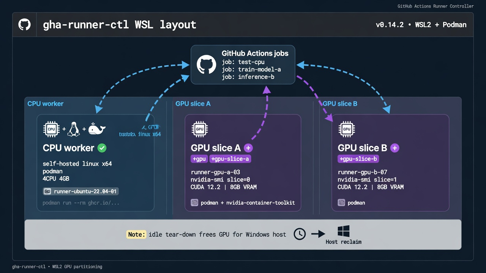
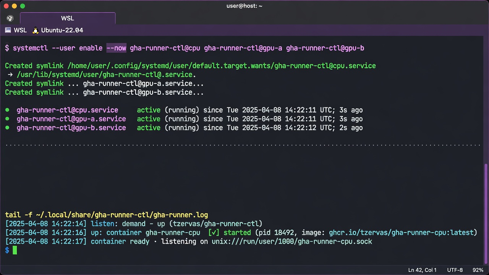
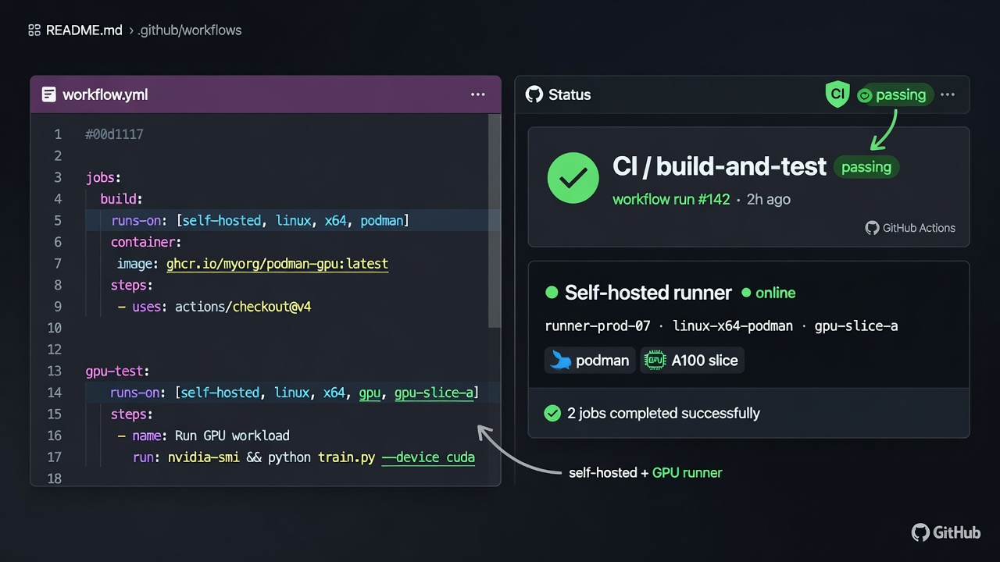

# gha-runner-ctl

<!-- FLEET-BADGES:BEGIN -->
[](https://github.com/tzervas/gha-runner-ctl/actions/workflows/fleet-ci.yml?query=branch%3Amain)
[](https://github.com/tzervas/gha-runner-ctl/actions/workflows/fleet-security.yml?query=branch%3Amain)
<!-- FLEET-BADGES:END -->

Hardened Rust fleet agent for GitHub Actions self-hosted runners on Podman: long-lived control plane, ephemeral (or warm-retain) work containers, paced registration, multi-instance CPU + soft GPU slices (WSL).

[](https://github.com/tzervas/gha-runner-ctl/actions/workflows/ci.yml?query=branch%3Amain)
[](LICENSE)
[](rust-toolchain.toml)
[](docs/QUICKSTART.md)

CI badge reflects self-hosted workflow status on `main` (`runs-on: [self-hosted, linux, x64, podman]`). It is only green when a host listener registers a runner and completes the job—no GitHub-hosted fallback.

Docs: [QUICKSTART](docs/QUICKSTART.md) · [HOST_OPS](docs/HOST_OPS.md) · [SECURITY](docs/SECURITY.md) · [CONSUMERS](docs/CONSUMERS.md) · [DESIGN](docs/DESIGN.md)

[MIT](LICENSE) · [NOTICE](NOTICE) (cites [actions/runner](https://github.com/actions/runner), also MIT)

## Screenshots / phases

| Phase | Visual |
|-------|--------|
| Fleet layout (CPU + GPU slices) |  |
| Enable listeners |  |
| Workflows → self-hosted |  |

Real host snapshot text: [docs/assets/setup-status.txt](docs/assets/setup-status.txt).

## Why

| Goal | Approach |
|---|---|
| Long-lived control plane | Fleet agent (`gha-runner-ctl`) stays up; work containers are the job surface |
| Dual agent deploy | Host binary + systemd or Ubuntu-minimal stripped micro-agent image (`packaging/Containerfile.agent`) |
| Fast work start | Work image + volume snapshot (`prepare`) — no tarball download on the hot path |
| Secure / intelligent register | Paced registration-token POSTs; REUSE retain; `warm` for allowlist; private `0600` env shred |
| Idle cost | Ephemeral work + idle timeout (GPU freed when no GPU workers remain); or warm retain for push |
| Many repos | Prefer `warm` one retain endpoint per allowlisted repo; else user batch / org |
| Horizontal | Multiple agent units (locks per `--container`): e.g. 1× CPU + 2× GPU soft-slices |
| GPU (WSL) | `--gpu` + optional `--gpu-slice a\|b` (time-share on consumer GeForce; no MIG) |

## Key features

1. `--full-auto`: Detects cwd git checkout → repo scope, else defaults to personal user batch. Prepares the Podman snapshot if missing, then starts the listener (interval 180s, idle 500s).
2. `--auto` / `detect`: Infer `owner/repo` from the current checkout (`gh repo view` / `git remote`).
3. Secret handling: Prefer GCM (`git credential fill`), `gh auth token`, config file, or a masked interactive prompt. Raw `ghp_` / `github_pat_` patterns on the CLI argv are blocked (history/process leaks). Tokens may also be supplied via `GH_TOKEN` / `GITHUB_TOKEN` env (accepted by design; avoid if your environment logs env vars).
4. Git Credential Manager (GCM): Optional install assist on Debian/Ubuntu; store/retrieve PAT without pasting into shell history.
5. Visibility filters: `--public-only` (default when unset), `--private-only`, or `--all-repos`.
6. Scopes: `repo` | `user` (batch personal) | `org` (org-level registration).
7. Hardened container: Non-root `runner` (UID 1001), `no-new-privileges`, `--pull=never` on hot path.
8. Demand filters (0.2.4+): `--demand-require-labels` / `--demand-exclude-labels` so CPU listeners ignore GPU jobs and GPU listeners only wake on `gpu`.
9. Sticky user-batch: do not recycle registration while the active repo still has matching work.
10. Multi-instance locks: `up`/`listen` locks namespaced by `--container`.

## Requirements

- Podman on the host
- Rust 1.96+ only if building from source
- Token that can create runner registration tokens:
  - Repo: admin on that repository  
  - Org: org owner / runner admin  
  - User batch: ability to register runners on each owned personal repo that will run jobs  

Personal GitHub user accounts only get repo-scoped runners. For one registration across many repos under an org, use `--scope org`.

## Install

### Release binary (preferred)

```bash
VER=0.2.6
TARGET=x86_64-unknown-linux-gnu
BASE="https://github.com/tzervas/gha-runner-ctl/releases/download/v${VER}"

curl -fsSL -o "gha-runner-ctl-${VER}-${TARGET}.tar.gz" \
  "${BASE}/gha-runner-ctl-${VER}-${TARGET}.tar.gz"
curl -fsSL -o "SHA256SUMS-${VER}.txt" \
  "${BASE}/SHA256SUMS-${VER}.txt"
sha256sum -c "SHA256SUMS-${VER}.txt"
tar xzf "gha-runner-ctl-${VER}-${TARGET}.tar.gz"
cd "gha-runner-ctl-${VER}-${TARGET}"
bash install.sh
export PATH="$HOME/.local/bin:$PATH"
gha-runner-ctl --help
```

### From source

```bash
git clone https://github.com/tzervas/gha-runner-ctl.git
cd gha-runner-ctl
bash packaging/install-ctl.sh
export PATH="$HOME/.local/bin:$PATH"
```

## Quick start

### 1-click (`--full-auto`)

```bash
# Inside a git checkout → that repo; otherwise → personal user batch
gha-runner-ctl --full-auto
```

`scripts/auto-listen.sh` is a thin shim that execs `gha-runner-ctl --full-auto` (remaining args pass through).

### Current repo (`--auto`)

```bash
cd ~/work/your-repo
gha-runner-ctl --scope repo --auto listen --interval 180 --idle-secs 180
# inspect only:
gha-runner-ctl --scope repo --auto detect
```

### Batch all personal repos (`scope=user`)

One process. When a self-hosted job is queued on any owned personal repo (subject to visibility flags), the fleet agent ephemerally re-registers to that repo, runs the job, then can retarget the next.

```bash
gha-runner-ctl --scope user --user YOUR_LOGIN listen --interval 180 --idle-secs 180
# or full-auto outside a checkout (defaults to user batch; listen interval 180s)
gha-runner-ctl --full-auto
```

### Organization (`scope=org`)

Repos must live under the org. Personal `user/*` cannot use an org runner while remaining outside that org.

```bash
gha-runner-ctl --scope org --owner YOUR_ORG \
  listen --interval 180 --idle-secs 180
```

### Manual

```bash
gha-runner-ctl prepare
gha-runner-ctl --scope repo --repo owner/name up
gha-runner-ctl status
gha-runner-ctl down
```

## Commands

| Command | Description |
|---|---|
| `prepare` | Host package refresh (unless skipped), build image (`--pull=always`), seed snapshot volume |
| `up` | Fetch registration token, seed env, start Podman runner |
| `down` | Stop/remove container; ephemeral mode wipes registration on volume |
| `status` | Scope, container state, registration details |
| `detect` | Print resolved registration target without starting |
| `listen` | Poll for demand; up/down; with `scope=user`, re-target per repo |

Global flags (selection): `--scope`, `--repo`, `--owner`, `--user`, `--auto`, `--full-auto`, `--mode ephemeral|retain`, `--public-only` / `--private-only` / `--all-repos`, `--skip-host-update` (prepare), `GHA_WAKE_TOKEN` + `listen --wake-port`.

## Modes

| Mode | Behavior |
|---|---|
| `ephemeral` (default) | Fresh registration each `up`; runner drops after one job |
| `retain` | Keep `.runner` on the snapshot volume across restarts |

```bash
gha-runner-ctl --mode retain up
```

## Consumer workflows

In any repo that should use this host, match the runner labels (default: `self-hosted,linux,x64,podman`):

```yaml
jobs:
  ci:
    runs-on: [self-hosted, linux, x64, podman]
    steps:
      - uses: actions/checkout@v4
      # …
```

See [docs/CONSUMERS.md](docs/CONSUMERS.md).

## Host residual ops (human-gated)

Install and listen are safe unattended on a prepared machine; host package upgrades touch the workstation and stay human-gated.

1. Install 0.2.6 (release tarball above, or `bash packaging/install-ctl.sh` from source).
2. Authenticate: `gh auth login` and/or GCM and/or `GH_TOKEN` (least privilege for registration).
3. Prepare (builds image + snapshot; by default also runs host `apt`/`dnf` upgrade):

   ```bash
   gha-runner-ctl prepare
   # skip host packages when intentional:
   gha-runner-ctl prepare --skip-host-update
   # or: GHA_SKIP_HOST_UPDATE=1 gha-runner-ctl prepare
   ```

4. Listen (user batch example):

   ```bash
   gha-runner-ctl --scope user --user YOUR_LOGIN --public-only listen --interval 180 --idle-secs 180
   ```

5. Future host upgrades: re-run `prepare` when you intend to refresh host packages + base image; use `--skip-host-update` on air-gapped or carefully pinned hosts.

More detail: [docs/HOST_OPS.md](docs/HOST_OPS.md).

## Security model (summary)

- Allowlist validation on repo/owner/labels/cpus/memory/image (no shell metacharacters into Podman/API)
- Short-lived registration tokens; log redaction (`ghp_`, `github_pat_`, `Bearer`, …)
- Single-instance PID lock file on `up` / `listen` (exclusive create; not `flock(2)`)
- Wake endpoint: loopback only; requires `GHA_WAKE_TOKEN` (≥16 chars); constant-time compare (token bytes not lowercased)
- Prefer private repos on self-hosted compute

Details: [docs/SECURITY.md](docs/SECURITY.md).

## Citation / license

- This project: MIT (Tyler Zervas), see [LICENSE](LICENSE).
- Official runner binary: MIT ([actions/runner](https://github.com/actions/runner)), see [NOTICE](NOTICE).